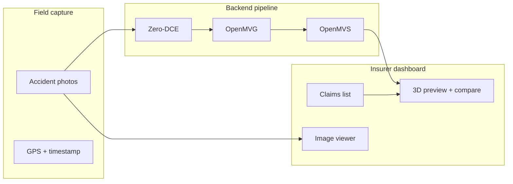

# Intelligent 3D Accident Claim System

Monorepo for **KADUNA.LK** — an insurer-facing platform to review motor accident claims with uploaded photos, GPS/timestamp validation, and interactive **3D vehicle reconstruction**.

Insurers use the dashboard to inspect claim metadata, browse accident images, and compare a **damaged vehicle mesh** against a **reference model** before approving or flagging a claim for inspection.

---

## How it works



| Stage | Tool | Purpose |
| ----- | ---- | ------- |
| 1 | **Zero-DCE** | Enhance low-light images before reconstruction |
| 2 | **OpenMVG** | Structure from motion — camera poses, sparse point cloud |
| 3 | **OpenMVS** | Dense point cloud and textured mesh |
| — | **Dashboard** | Review claims, images, and 3D output |

---

## Repository structure

```
Insurer-Dashboard/
├── frontend/
│   ├── public/images/              Static assets (accident placeholders)
│   └── src/
│       ├── pages/                  Route-level views
│       ├── components/
│       │   ├── dashboard/          Claims list, detail panel, image gallery
│       │   └── three/              3D preview & compare view (R3F)
│       ├── styles/                 All CSS (single entry: styles/index.css)
│       ├── data/                   Mock claim data
│       └── types/                  TypeScript types
│
└── backend/
    └── app/
        ├── api/routes/             Health & pipeline endpoints
        └── services/               Zero-DCE, OpenMVG, OpenMVS stubs
```

| Folder | Stack |
| ------ | ----- |
| `frontend` | React 19, TypeScript, Vite, Three.js, React Three Fiber, drei, Roboto |
| `backend` | Python 3.9+, FastAPI, Uvicorn |

---

## Frontend (insurer dashboard)

The main page matches the **Intelligent 3D Accident Claim System** design:

- **Left** — searchable claims table (select a row to load details)
- **Right** — claim metadata, validation status, action buttons
- **3D preview** — rotating damaged vehicle model (placeholder until real meshes are loaded)
- **Compare view** — side-by-side damaged vs reference car with measurement lines
- **Accident images** — gallery overlay via **Accident Images → View**

### Run locally

```bash
cd frontend
npm install
npm run dev
```

Open [http://localhost:5173](http://localhost:5173).

| Script | Description |
| ------ | ----------- |
| `npm run dev` | Development server |
| `npm run build` | Production build |
| `npm run preview` | Preview production build |

The dev server proxies `/api` to the backend on port **8000**.

### Key paths

| Path | Description |
| ---- | ----------- |
| `src/pages/DashboardPage.tsx` | Main dashboard layout |
| `src/styles/index.css` | **Single CSS entry** (imports variables, dashboard, three) |
| `src/styles/variables.css` | Design tokens (colors, radii, fonts) |
| `src/components/dashboard/` | Claims table, claim detail, accident images |
| `src/components/three/` | 3D preview & compare view |
| `public/images/` | Placeholder accident uploads |

---

## Backend (photogrammetry API)

FastAPI service that orchestrates **Zero-DCE → OpenMVG → OpenMVS**. Pipeline steps are stubbed in `backend/app/services/` — wire in your built binaries and model weights when ready.

### Run locally

```bash
cd backend
python3 -m venv .venv
source .venv/bin/activate          # Windows: .venv\Scripts\activate
pip install -r requirements.txt
cp .env.example .env               # Set tool paths
uvicorn app.main:app --reload --host 0.0.0.0 --port 8000
```

| URL | Description |
| --- | ----------- |
| [http://localhost:8000](http://localhost:8000) | API root |
| [http://localhost:8000/docs](http://localhost:8000/docs) | Swagger UI |
| `GET /api/health` | API status + which tools are configured |

### Environment variables

Copy `backend/.env.example` to `backend/.env`:

| Variable | Description |
| -------- | ----------- |
| `OPENMVG_BIN_DIR` | Path to OpenMVG `install/bin` |
| `OPENMVS_BIN_DIR` | Path to OpenMVS `install/bin` |
| `ZERO_DCE_REPO_DIR` | Zero-DCE repository root |
| `ZERO_DCE_WEIGHTS` | Path to trained weights (e.g. `Epoch99.pth`) |
| `DATA_DIR` | Uploads and job output workspace |

### API endpoints

| Method | Path | Description |
| ------ | ---- | ----------- |
| `GET` | `/api/health` | Health check and tool configuration status |
| `GET` | `/api/pipeline/stages` | List pipeline stages |
| `POST` | `/api/pipeline/jobs` | Create a reconstruction job workspace |
| `POST` | `/api/pipeline/jobs/{id}/run` | Run the full pipeline (background by default) |

---

## External dependencies

Install and build separately, then point `backend/.env` at the binaries:

- [OpenMVG](https://github.com/openMVG/openMVG) — sparse reconstruction
- [OpenMVS](https://github.com/cdcseacave/openMVS) — dense mesh
- [Zero-DCE](https://github.com/Li-Chongyi/Zero-DCE) — low-light enhancement

---

## Development

| Branch | Purpose |
| ------ | ------- |
| `main` | Stable baseline |
| `dev` | Active development |

Typical workflow: run **backend** and **frontend** in separate terminals, select a claim in the UI, and iterate on pipeline services or 3D mesh loading.

### Current status

| Area | Status |
| ---- | ------ |
| Insurer dashboard UI | Implemented (mock data) |
| 3D preview & compare view | Implemented (procedural car placeholders) |
| Accident image gallery | Implemented (placeholder SVGs) |
| FastAPI scaffold + pipeline routes | Implemented |
| Zero-DCE / OpenMVG / OpenMVS execution | Stubbed — needs binary paths and CLI wiring |
| Frontend ↔ backend claim API | Not yet connected |

### Next steps

- Connect dashboard to live claim and upload APIs
- Load OpenMVS meshes (GLTF/OBJ) in `CompareViewCanvas`
- Implement pipeline services in `backend/app/services/`
- Replace mock claims with persistence (database)

---

## License

Private project — Allianz Insurance Lanka Limited / KADUNA.LK.
