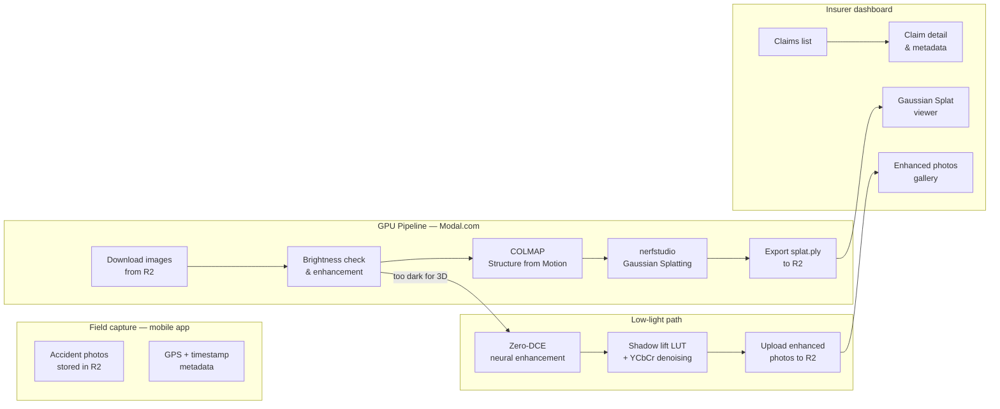

# Intelligent 3D Accident Claim System

Monorepo for **KADUNA.LK** — an insurer-facing platform to review motor accident claims with uploaded photos, GPS/timestamp validation, and interactive **3D Gaussian Splat vehicle reconstruction**.

Insurers use the dashboard to inspect claim metadata, browse accident images, and view a photo-realistic **Gaussian Splat** of the damaged vehicle — or, when lighting conditions were too poor for 3D, browse **Zero-DCE enhanced photos** of the accident scene.

---

## How it works



### Pipeline stages

| Stage | Tool | Trigger | Purpose |
|-------|------|---------|---------|
| 1 | **Download** | Always | Pull photos from Cloudflare R2 to Modal GPU worker |
| 2 | **Enhance** | Always | Measure mean brightness, apply correction tier |
| — | ↳ Low-light path | mean < 50 | Zero-DCE + shadow lift + YCbCr denoise → upload enhanced photos, skip 3D |
| — | ↳ Very dark | mean 50–60 | Zero-DCE neural enhancement, then continue to COLMAP |
| — | ↳ Dark | mean 60–100 | Gamma correction, then continue to COLMAP |
| 3 | **COLMAP** | Sufficient light | Structure from Motion — camera poses + sparse point cloud |
| 4 | **nerfstudio** | After COLMAP | Train 3D Gaussian Splat (`splatfacto`) |
| 5 | **Export** | After training | Export `splat.ply` to R2 |

---

## Low-light enhancement

When accident photos are too dark for reliable 3D reconstruction (mean pixel brightness below 50/255), the pipeline skips 3D entirely and instead produces enhanced photos for the insurer to review.

The enhancement runs three stages in sequence:

### Stage 1 — Zero-DCE neural enhancement
**Zero-Reference Deep Curve Estimation** — a lightweight CNN (~8 MB weights) that enhances image brightness without needing paired training data. It iteratively applies learned tone curves directly to the RAW pixel values. Runs on the Modal GPU (L4) worker, or locally on MPS (Apple Silicon) / CUDA.

- Weights: `Epoch99.pth` from the [official Zero-DCE repo](https://github.com/Li-Chongyi/Zero-DCE)
- Auto-downloaded to `~/.cache/insurer_dashboard/zerodce_Epoch99.pth` on first use

### Stage 2 — Shadow lift LUT
A piecewise lookup table that selectively brightens shadow regions without affecting highlights:

- Pixels < 40% brightness → gamma 2.0 (strong lift)
- Pixels 40–70% → blend from lifted to unchanged
- Pixels > 70% → untouched (highlights preserved)

This recovers tire details, wheel arches, and underside damage that Zero-DCE alone leaves dark.

### Stage 3 — YCbCr noise reduction
GPU-enhanced shadows amplify sensor noise. The image is split into luminance (Y) and chroma (Cb, Cr) channels:

- **Y** → MedianFilter(size=3) — removes luminance grain while preserving edges
- **Cb, Cr** → GaussianBlur(radius=3) — eliminates colour noise (purple/green artefacts from amplified sensor noise)

The enhanced photos are uploaded to `jobs/{job_id}/enhanced/` in R2 and are accessible via the **View Enhanced Photos** button in the dashboard.

---

## Storage — Cloudflare R2

All files are stored in Cloudflare R2 (S3-compatible). No local database is used by the dashboard backend.

| R2 path | Contents |
|---------|---------|
| `{Name} - {NIC}/step-1-photos-uploaded/` | Original accident walkaround photos from mobile app |
| `{Name} - {NIC}/step-2-fraud-validation/user-verification/` | Driving licence + sobriety test photos |
| `{Name} - {NIC}/step-2-fraud-validation/third-party/` | Third-party vehicle photos |
| `{Name} - {NIC}/locations/locations.json` | GPS coordinates at each capture step |
| `jobs/{job_id}/meta.json` | Links job to NIC + customer, stores creation timestamp |
| `jobs/{job_id}/status.json` | Live step progress written by the Modal worker |
| `jobs/{job_id}/enhanced/` | Zero-DCE enhanced photos (low-light path only) |
| `jobs/{job_id}/splat.ply` | Finished Gaussian Splat model (normal path) |

---

## Repository structure

```
Insurer-Dashboard/
├── frontend/
│   └── src/
│       ├── pages/                    Route-level views
│       ├── components/
│       │   ├── dashboard/            Claims list, detail panel, pipeline steps, image galleries
│       │   └── three/                Gaussian Splat viewer (CompareViewCanvas)
│       ├── styles/                   CSS (variables, dashboard, three)
│       └── types/                    TypeScript types
│
└── backend/
    ├── modal_pipeline.py             Modal GPU pipeline (deploy to Modal.com)
    ├── enhance_photos.py             Local CLI for Zero-DCE enhancement
    ├── requirements.txt
    └── app/
        ├── api/routes/               claims, pipeline endpoints
        ├── services/
        │   ├── pipeline.py           Job creation, Modal spawn, R2 status polling
        │   ├── r2.py                 Cloudflare R2 client (download, upload, presign, list)
        │   └── zero_dce.py           Local Zero-DCE service (ZeroDCEService class)
        ├── schemas/pipeline.py       Pydantic models + enums (PipelineJobStatus, StepStatus)
        └── config.py                 Settings from .env
```

| Folder | Stack |
|--------|-------|
| `frontend` | React 19, TypeScript, Vite, Three.js, React Three Fiber, `@mkkellogg/gaussian-splats-3d` |
| `backend` | Python 3.11+, FastAPI, Uvicorn, Modal, boto3, torch, Pillow |

---

## Frontend

- **Claims table** (left) — searchable list of all claims from R2
- **Claim detail** (right) — NIC, customer, policy, vehicle, GPS/timestamp validation
- **Action views** — Accident Images, User Verification, 3rd Party Details, Location Details
- **Generate 3D Model** — triggers Modal GPU pipeline, shows live step progress
- **Pipeline steps panel** — floating panel showing download → enhance → COLMAP → train → export
- **View 3D Model** — loads `splat.ply` from R2 into the in-browser Gaussian Splat viewer
- **View Enhanced Photos** — shows Zero-DCE enhanced photos when lighting was insufficient for 3D (persists across page reloads via NIC lookup)

### Run locally

```bash
cd frontend
npm install
npm run dev
```

Open [http://localhost:5173](http://localhost:5173).

The dev server proxies `/api` → backend on port **8080**.

---

## Backend

### Run locally

```bash
cd backend
python3 -m venv .venv
source .venv/bin/activate
pip install -r requirements.txt
cp .env.example .env   # fill in R2 credentials
uvicorn app.main:app --reload --host 0.0.0.0 --port 8080
```

### Environment variables (`backend/.env`)

| Variable | Description |
|----------|-------------|
| `PORT` | Backend port (default `8080`) |
| `R2_ENDPOINT_URL` | Cloudflare R2 endpoint URL |
| `R2_ACCESS_KEY_ID` | R2 access key |
| `R2_SECRET_ACCESS_KEY` | R2 secret key |
| `R2_BUCKET_NAME` | R2 bucket name |

### API endpoints

| Method | Path | Description |
|--------|------|-------------|
| `GET` | `/api/health` | Health check |
| `GET` | `/api/claims` | List all claims from R2 |
| `GET` | `/api/claims/{nic}/models` | List completed 3D models for a NIC |
| `GET` | `/api/claims/{nic}/enhanced-jobs` | List low-light enhanced photo jobs for a NIC |
| `POST` | `/api/pipeline/jobs` | Create a pipeline job (downloads images to verify) |
| `POST` | `/api/pipeline/jobs/{id}/run` | Start Modal GPU pipeline (`?background=true`) |
| `GET` | `/api/pipeline/jobs/{id}/status` | Live job status (steps + overall) |
| `GET` | `/api/pipeline/jobs/{id}/splat` | Stream the finished `splat.ply` file |
| `GET` | `/api/pipeline/jobs/{id}/enhanced-photos` | Pre-signed URLs for enhanced photos |

---

## GPU pipeline — Modal.com

The reconstruction pipeline runs as a serverless GPU function on [Modal.com](https://modal.com) with an L4 GPU. It is deployed separately from the FastAPI backend.

### Deploy

```bash
cd backend
python3 -m modal deploy modal_pipeline.py
```

The deployed function name is `insurer-pipeline/run_pipeline`. The backend calls it via `modal.Function.from_name(...)`.

### What the Modal function does

1. Downloads images from R2 using the provided prefix
2. Measures mean pixel brightness across all images
3. Applies the appropriate enhancement tier (see [Low-light enhancement](#low-light-enhancement) above)
4. If mean brightness < 50: uploads enhanced photos to R2, writes `status.json` with `"overall": "low_light"`, returns early
5. Otherwise: runs COLMAP (feature extraction, matching, sparse reconstruction)
6. Trains a Gaussian Splat with `nerfstudio splatfacto`
7. Exports `splat.ply` to R2
8. Writes final `status.json` with `"overall": "completed"`

The function writes live step progress to `jobs/{job_id}/status.json` throughout so the backend can poll and stream updates to the frontend.

---

## Local Zero-DCE CLI

To enhance photos locally without running the full Modal pipeline:

```bash
cd backend

# Enhance a local directory of photos (in-place)
python3 enhance_photos.py --dir /path/to/photos

# Enhance a local directory and save to a separate output folder
python3 enhance_photos.py --dir /path/to/photos --out /path/to/output

# Download photos for a claim from R2, enhance, and re-upload
python3 enhance_photos.py --claim "Firstname Lastname - NIC123456"
```

Zero-DCE weights are downloaded automatically on first use to `~/.cache/insurer_dashboard/zerodce_Epoch99.pth`. The CLI uses MPS (Apple Silicon), CUDA, or CPU — whichever is available.

---

## Pipeline job status values

| Overall status | Meaning |
|---------------|---------|
| `pending` | Job created, not yet started |
| `running` | Modal worker active |
| `completed` | `splat.ply` ready in R2 |
| `low_light` | Too dark for 3D — enhanced photos uploaded to R2 |
| `failed` | Pipeline error |

| Step status | Meaning |
|------------|---------|
| `pending` | Not yet reached |
| `running` | Currently executing |
| `done` | Completed successfully |
| `skipped` | Bypassed (low-light path skips COLMAP → train → export) |
| `failed` | Step errored |

---

## Development

| Branch | Purpose |
|--------|---------|
| `main` | Stable baseline |
| `dev` | Active development |
| `gaussian-splatting-test` | Gaussian Splat viewer and pipeline integration |

Typical workflow: run backend and frontend in separate terminals, select a claim in the UI, click **Generate 3D Model** to trigger the Modal pipeline, and watch the steps panel update in real time.

---

## Current status

| Area | Status |
|------|--------|
| Claims dashboard UI | Implemented — live data from R2 |
| Accident image gallery | Implemented — pre-signed R2 URLs |
| User verification + 3rd party panels | Implemented |
| Location details (GPS + timestamps) | Implemented |
| Modal GPU pipeline (COLMAP + nerfstudio) | Implemented and deployed |
| Gaussian Splat viewer | Implemented — streams `splat.ply` from R2 |
| Live pipeline step progress | Implemented — polls R2 status.json every 4 s |
| Multiple models per claim | Implemented — model picker by NIC |
| Low-light detection + Zero-DCE enhancement | Implemented — three-stage enhancement |
| Shadow lift LUT + YCbCr denoising | Implemented — reduces grain from boosted shadows |
| Enhanced photos gallery | Implemented — persists across reloads via NIC lookup |
| Local Zero-DCE CLI (`enhance_photos.py`) | Implemented |

---

